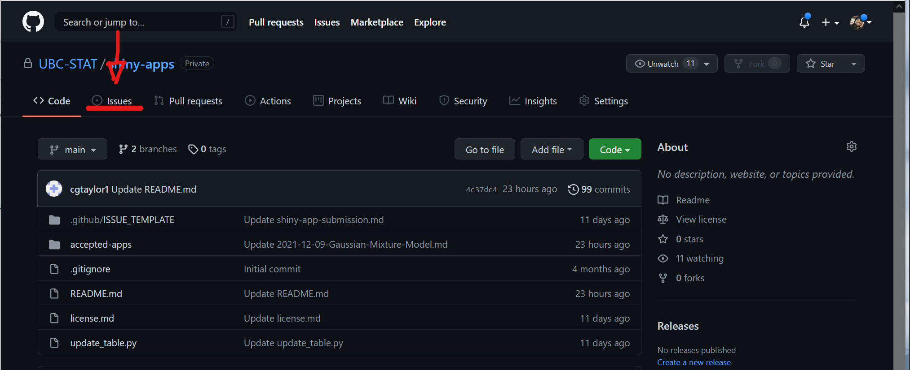
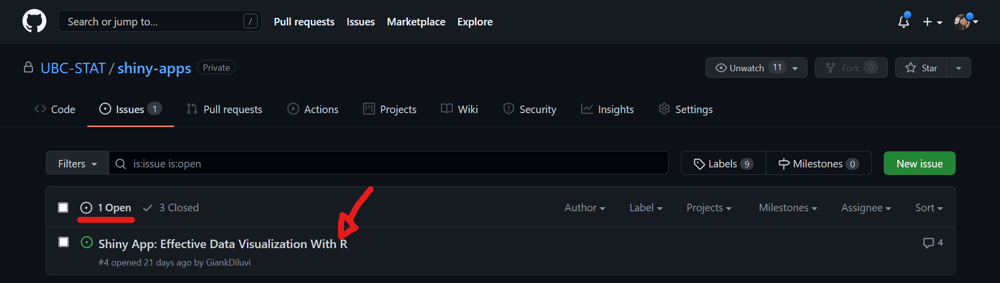
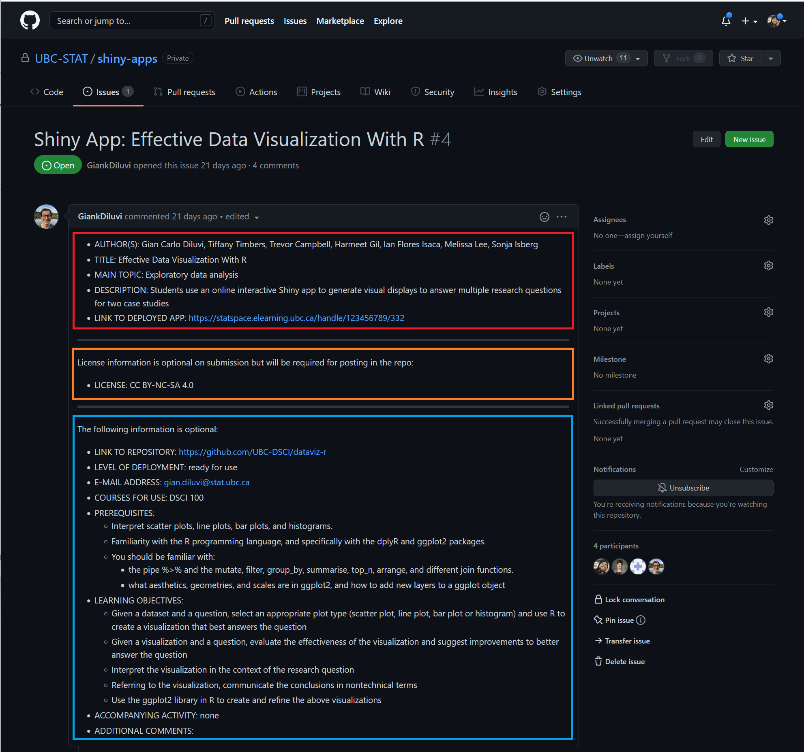
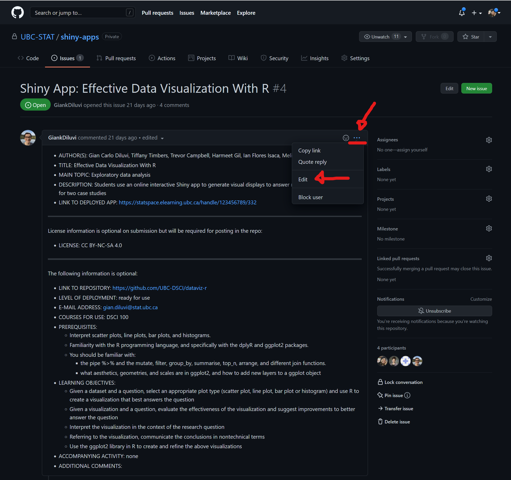
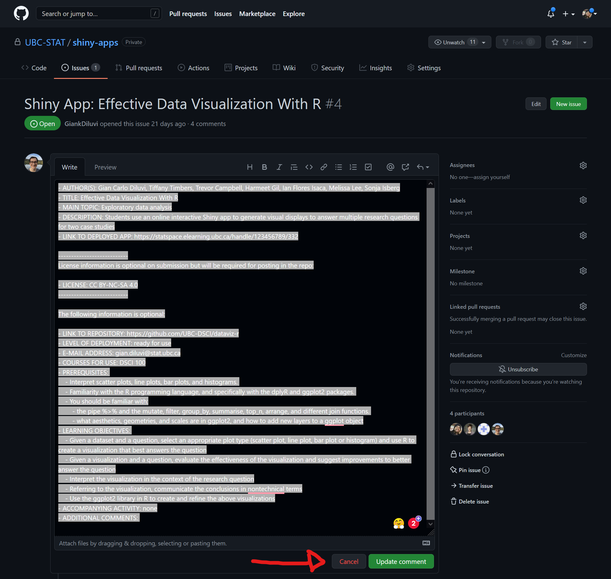
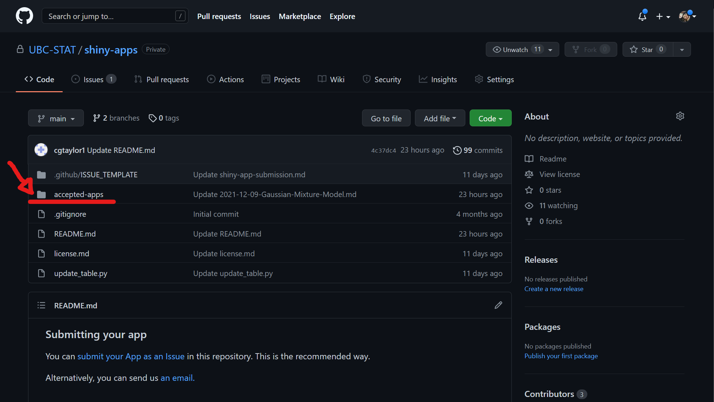
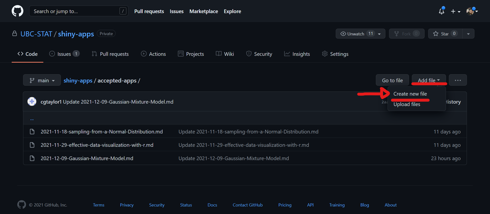
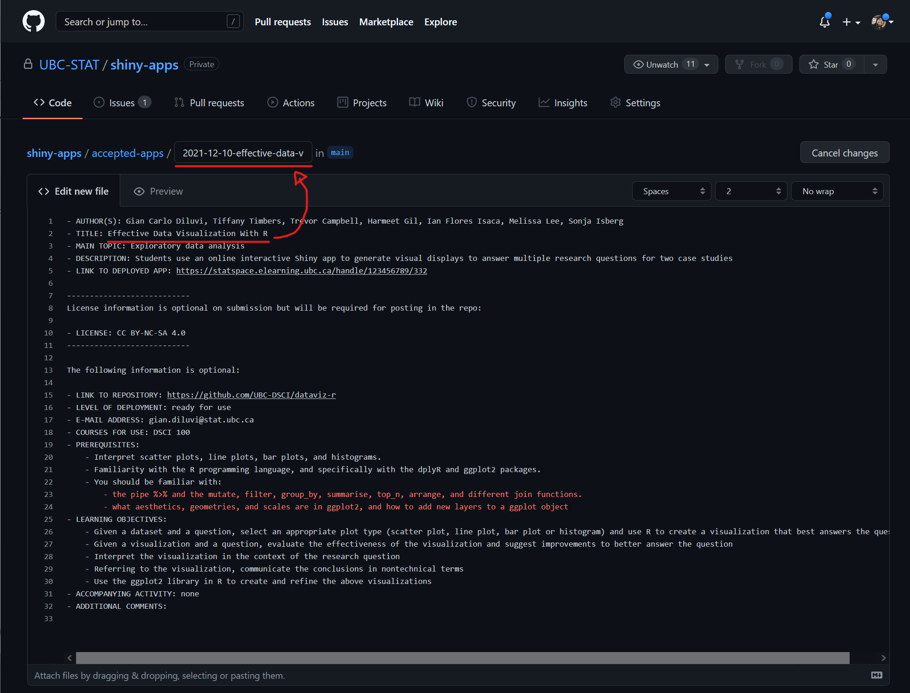

# Handling Submissions

## Submission by Issue

1. Go to issues;

2. In open issues, select the submission you want to process. For example, in this case, we will process "*Shiny App: Effective Data Visualization With R*".

3. Here, you are going to see the submission. There are mainly three parts for the submission:
    - **The red part** is required
    - **The orange part** is also required before acceptance, but some authors might not know what to use before, and some support on our part might be necessary. We can communicate with the authors. We can point them to our [license](https://github.com/UBC-STAT/shiny-apps/blob/main/license.md) file.
    - **The blue part** is not required at all. It is ok if the authors do not fill those in.

4. Please check that the required information is there, that all links work, and that the app runs and seems to be the correct one for the title.  

5. If necessary, we can reply to the issue to communicate with the author.  Reply by scrolling to the end of the issue page, filling in the blank message box and pressing the green "Comment" box.

6. Once the app is accepted, go to the three dots and click on edit:

7. You should now be able to edit the text. Please **do not** change anything in this text. We just want to copy it. Please `cmd + A` on MAC or `ctrl + A` on Windows/Linux to select all the text. Then press `cmd + C` (MAC) or `ctrl + C` (Windows/Linux) to copy the text. Then click on **Cancel** button at the bottom of the comment.

8. Next, go to `accepted-apps` folder.

9. Create a new file:

10. Paste the content you copied from the issue `cmd + V` (MAC) or `ctrl + V` (Windows/Linux). Name the file as `YYYY-MM-DD-title-of-the-app.md`. Use `-` for whitespaces and remember to add the `.md` at the end.

11. Commit the file (a green button at the very bottom of the page).

12. Close the issue: go to the specific issue page, scroll down to the bottom, fill in the message box "Thank you for your submission. It now appears in the Shiny Repo."  Press "Close issue".

That's it!

## Submission by E-mail

If the authors submit by e-mail, the workflow is very similar to what we did above. But in that case, the information will be in the e-mail, and must be copied from there. But then, we create a file in `accepted-apps` folder the same way.

For e-mail submissions, make sure to take a screenshot of the e-mail with the metadata (day, hour, title, from, to) and the app info. Then, save the screenshot in a folder called `e-mail submission`.

Don't forget to email the submitter, once the submission has been processed.
